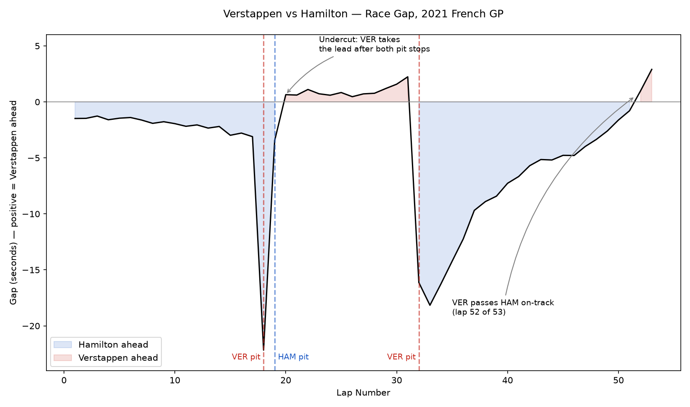
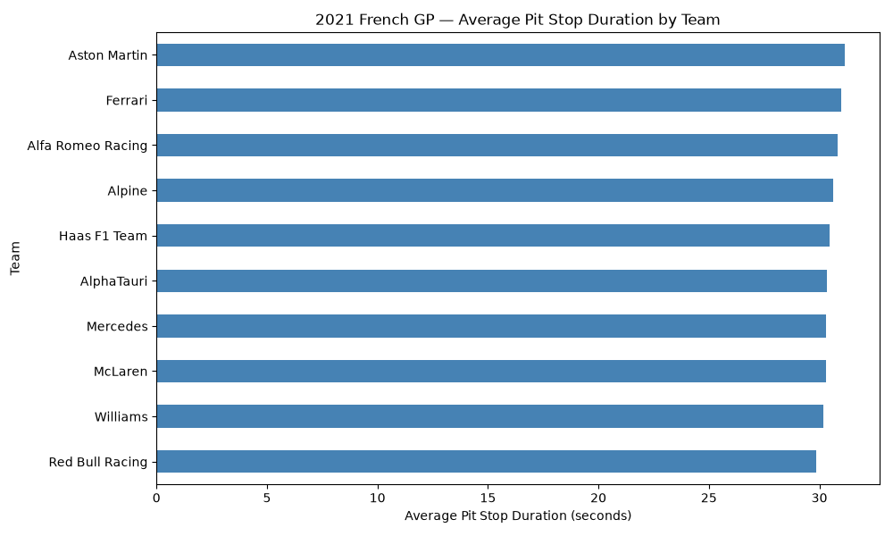

# F1 Pit Stop Strategy Analysis — 2021 French Grand Prix

Analysis of how pit stop timing (the "undercut") and pit crew execution 
affected the Verstappen–Hamilton lead battle, using real telemetry and 
timing data via the FastF1 library.

## Research Question

How did pit stop timing decide the lead battle between Max Verstappen and 
Lewis Hamilton in the 2021 French GP. First through an undercut at the 
first round of stops, then through a tire-age pace advantage after 
Verstappen's second stop?

## Setup

```bash
python3 -m venv venv
source venv/bin/activate
pip install fastf1 pandas matplotlib
python3 02_gap_analysis.py
python3 03_pit_durations.py
```

## The Undercut

Verstappen started from pole but ran wide at Turn 1, handing the lead to Hamilton at the start. Hamilton controlled the race from there, building a gap of roughly 3 seconds by lap 17. At the first round of stops, Red Bull reacted to Mercedes pitting Bottas by bringing Verstappen in on lap 18, one lap before Hamilton. Verstappen's out-lap was strong enough that when Hamilton pitted a lap later, he rejoined the track just behind Verstappen instead of ahead. The gap analysis confirms this directly in the timing data. Hamilton was 3.1 seconds ahead on lap 17, and by lap 20, once both drivers had completed their stops, Verstappen was 0.65 seconds ahead. A net swing of about 3.75 seconds decided entirely by a one-lap difference in pit timing.



## The Two Stop Recovery

Verstappen held a narrow lead for over a dozen laps before Red Bull committed to a second stop at the end of lap 32, switching to fresher tires while Hamilton and Mercedes stayed on a one-stop strategy. This dropped Verstappen to roughly 18 seconds behind by lap 33. From there, tire age became the deciding factor: Hamilton and Bottas's tires degraded through the closing laps, and Verstappen closed the gap steadily on newer rubber, passing Perez, then Bottas, and finally catching Hamilton, taking the lead on lap 52 of 53 and winning by 2.9 seconds. In the data, this shows up as an 18-to-19 second recovery over roughly 19 laps, an average pace advantage of about 1 second per lap.

## Team Pit Stop Comparison

Across the field, average pit lane duration (time from pit entry to pit exit) ranged narrowly from Red Bull's 29.86 seconds to Aston Martin's 31.17 seconds. A spread of only about 1.3 seconds across all ten teams. Red Bull was fastest on average, consistent with their reputation as the strongest pit crew of that era. It's worth noting this metric measures total time in the pit lane, not the isolated tire-change time itself (media-reported tire-change times that day were closer to 2-2.5 seconds); the pit lane duration is still a fair basis for comparing teams since every car travels the same pit lane at the same speed limit. Notably, the ~1.3-second spread between the fastest and slowest crews is smaller than the ~3.75-second swing created by Verstappen's one-lap earlier pit call. Suggesting that in this race, strategic timing mattered more than raw crew execution speed.



## Limitations & Future Work

This analysis uses lap-level cumulative time to measure the gap between drivers, which captures the net effect of pace, tire age, and traffic combined. It doesn't isolate pure pace in clean air from the effect of running behind another car. A more rigorous version would filter to laps where each driver had clear track ahead of them before comparing pace.

The pit stop duration metric measures total pit lane time (entry to exit), not the isolated tire-change time that teams report separately (often 2-3 seconds). This is a reasonable proxy for comparing crews since every car uses the same pit lane, but it's a different metric than "wheel gun speed," and worth being explicit about.

This analysis covers one race. A natural extension would be running the same gap and pit-duration analysis across multiple races or a full season to see whether the pit-duration rankings and the general "strategy timing matters more than crew speed" pattern hold up, or whether this race was an outlier.